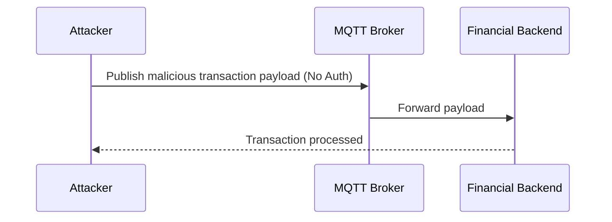

## Executive Summary
This case study explores the discovery of a critical vulnerability in an IoT implementation: an unauthenticated MQTT broker that could be abused to manipulate financial transactions. It also covers the remediation process using Mutual TLS (mTLS).

## 1. Vulnerability Discovery
*Explain how the unauthenticated MQTT broker was discovered and the potential impact of manipulating the published messages.*

## 2. Exploit Scenario
*Provide a high-level overview or flow diagram (using Mermaid.js) of how an attacker could exploit this.*

## 3. Remediation via mTLS
*Detail the implementation of Mutual TLS (mTLS) to ensure that only authenticated and authorized clients can publish or subscribe to the broker.*

## Conclusion
*Summarize the security improvements achieved post-remediation.*
