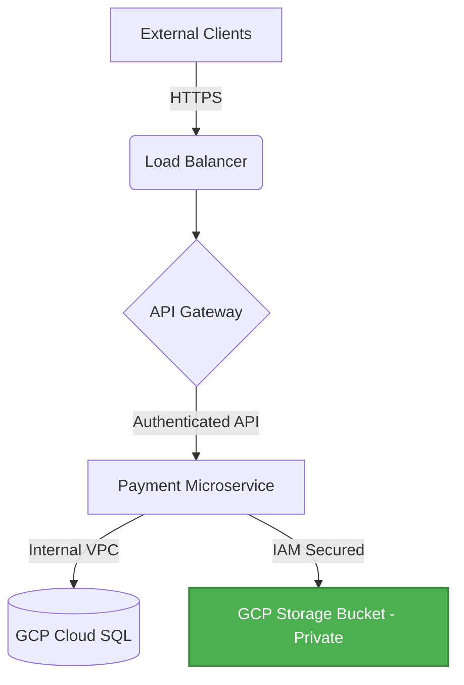

## Overview

This project involved a comprehensive review of a Google Cloud Platform (GCP) environment supporting payment microservices. The objective was to identify and remediate misconfigured Cloud Storage buckets and over-privileged IAM roles.

## Methodology

1.  **Enumeration:** Utilized Google Cloud Security Command Center and custom scripts to audit IAM policies across all storage buckets.
2.  **Architecture Review:** Mapped data flows to identify trust boundaries and unnecessary public access points.
3.  **Remediation:** Enforced strict IAM least-privilege policies and implemented Customer-Managed Encryption Keys (CMEK).

## Architecture Flow

## Results

*   Successfully secured 92+ GCP Storage buckets.
*   Eliminated 100% of identified public exposure paths.
*   Achieved zero production outages during the remediation process.
